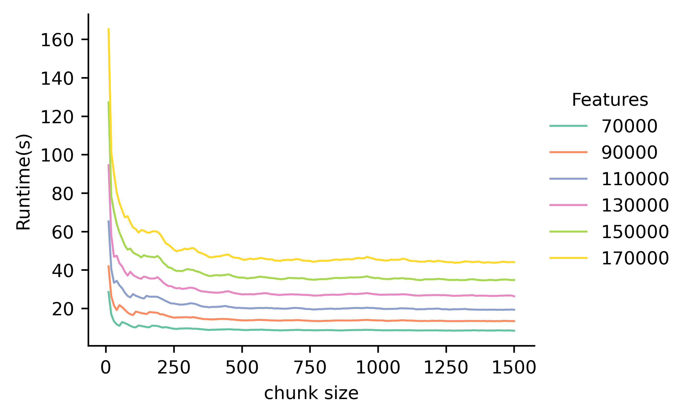

# pyNetCor

[](https://pynetcor.readthedocs.org/en/latest/?badge=latest)

**PyNetCor** is a fast Python C++ extension for correlation and network analysis on high-dimensional datasets. It aims to serve as a scalable foundational package to accelerate large-scale computations.

## Features

- Calculate correlation matrix using Pearson, Spearman, or Kendall methods
- Processing large-scale computation in chunks (larger than RAM)
- Find top-k and differential correlations between each row of two arrays
- Efficient P-value approximation and multiple testing correction
- Handle missing values
- Multi-thread

For more details, please refer to the [documentation](https://pynetcor.readthedocs.io/en/latest/).

## Installation

You can install pyNetCor using pip:

```bash
pip install pynetcor
```

## Quick Start

### Create Data

```python
import numpy as np

features = 100000
sampes = 100
arr1 = np.random.random((features, samples))
arr2 = np.random.random((features, samples))
```

### Calculate correlation matrix

Compute and return the full matrix at once.

```python
from pynetcor.cor import corrcoef

# using 8 threads
# Pearson correlations between `arr1` and itself
cor_result = corrcoef(arr1, threads=8)
```

Compute the matrix in chunks and return an `Iterator`, recommended for large-scale analysis that exceed RAM.

```python
from pynetcor.cor import chunked_corrcoef

# Calculate and return `chunk_size=1024` rows of the correlation matrix with each iteration.
cor_iter = chunked_corrcoef(arr1, chunk_size=1024, threads=8)
for cor_chunk_matrix in cor_iter:
    ...
```

### Top-k correlation search

Identify the accurate top k correlations (Spearman correlation).

```python
from pynetcor.cor import cor_topk

# top 1% correlations
cor_topk_result = cor_topk(arr1, method="spearman", k=0.001, threads=8)

# top 100 correlations
cor_topk_result = cor_topk(arr1, method="spearman", k=100, threads=8)

# Return a 2D array with 4 columns: [row_index, col_index, correlation, pvalue]
```

### Top-k differential correlation search

Identify the accurate top k differences in correlation between pairs of features across two states or time points.

```python
# Compute the pairwise correlations separately for `arr1` with `arr1`, and `arr2` with `arr2`, then identify the feature pairs with the largest difference
from pynetcor.cor import cor_topkdiff

# top 1% differential correlations
cor_topkdiff_result = cor_topkdiff(x1=arr1, y1=arr2, x2=arr1, y2=arr2, k=0.001, threads=8)

# top 100 differential correlations
cor_topkdiff_result = cor_topkdiff(x1=arr1, y1=arr2, x2=arr1, y2=arr2, k=100, threads=8)

# Return a 2D array with 5 columns: [row_index, col_index, diffCor, cor1, cor2]
```

### P-value computation

Compute the P-values for correlations (Pearson or Spearman) using the Student's t-distribution. The approximation method is significantly faster than the classical method, with the absolute errors are nearly less than 1e-8.

```python
from pynetcor.cor import corrcoef, pvalue_student_t
samples = arr1.shape[1]

# Generate the Pearson correlation matrix
cor_result = corrcoef(arr1, threads=8)

# P-value approximation
pvalue_result = pvalue_student_t(cor_result, df=samples-2, approx=True, threads=8)

# P-value classic
pvalue_result = pvalue_student_t(cor_result, df=samples-2, approx=False, threads=8)
```

### Unified implementation for calculating correlations and P-values.

```python
from pynetcor.cor import cortest, chunked_cortest

# Pearson correlation & P-value approximation
cortest_result = cortest(arr1, approx=True, threads=8)

# chunking computation, recommended for large-scale analysis that exceed RAM
for iter in chunked_cortest(arr1, approx=True, threads=8):
    for (row_index, col_index, correlation, pvalue) in iter:
        ...
        
# Return a 2D array with 4 columns: [row_index, col_index, correlation, pvalue]
```

Multiple testing correction: `holm`, `hochberg`, `bonferroni`, `BH`, `BY`.

```python
from pynetcor.cor import cortest, chunked_cortest

# Pearson correlation & multiple testing correction
cortest_result = cortest(arr1, adjust_pvalue=True, adjust_method="BH", threads=8)

# chunking computation, recommended for large-scale analysis that exceed RAM
for iter in chunked_cortest(arr1, adjust_pvalue=True, adjust_method="BH", threads=8):
    for (row_index, col_index, correlation, pvalue) in iter:
        ...
        
# Return a 2D array with 5 columns: [row_index, col_index, correlation, pvalue, adjusted_pvalue]       
```

NOTE: `chunked` function only supports approximate adjusted P-value. PyNetCor utilizes approximation methods to achieve effective FDR control before computing all P-values.

## Memory Management and Chunk Size Optimization

When conducting large-scale correlation analysis using pyNetCor, optimizing memory usage and chunk size is crucial for achieving optimal performance. Our experiments have revealed important relationships between dataset dimensions, `chunk_size`, runtime, and memory consumption (as illustrated in the figures below):

* Larger `chunk_size` generally lead to faster runtimes.
* The reduction in runtime becomes less significant as the `chunk_size` exceeds 500-1000.
* Memory consumption increases linearly with `chunk_size`.

<div style="display: flex; justify-content: center; align-items: center;">
  
  
</div>

Based on these observations, we can provide users with recommendations for optimizing `chunk_size`:

1. **Start with a moderate `chunk_size`:** Begin with a `chunk_size` around 500-750. This range typically offers a good balance between runtime performance and memory usage.
2. **Consider your dataset size:** For smaller datasets (e.g., 70,000-90,000 features), you may be able to use larger `chunk_size` without excessive memory consumption. This can potentially speed up processing times. However, for very large datasets (150,000+ features), you might need to use smaller `chunk_size` to manage memory constraints effectively. Always monitor system resources when working with large datasets.
3. **Fine-tune for your specific use case:** The optimal `chunk_size` can vary depending on your dataset size and available RAM. We recommend referring to our experimental results to guide your configuration. As a default setting designed to accommodate most analytical needs, we use a default `chunk_size` = 512. However, don't hesitate to adjust this based on your specific requirements and system capabilities.
